<div align="center">

# Any2Clawd

*"Plain language, and Claude Code comes to life."*

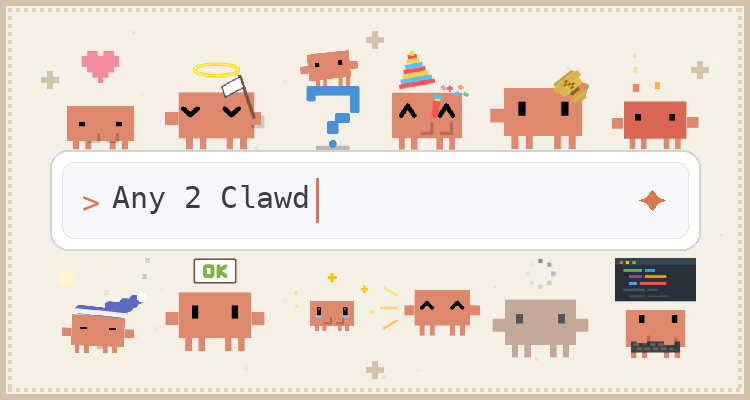


🦀 A natural-language-driven SVG animation generator for the **Clawd** pixel crab, packaged as a Claude Code skill.

🔧 Say something like "clawd, make a coffee animation" or "a little crab scratching its head in confusion" and the skill turns it into a loopable pixel animation, then exports a GIF sticker you can drop straight into a chat app.

[Setup](#setup) · [Make an emote](#make-an-emote) · [Gallery](#gallery) · [Export a GIF](#export-a-gif) · [中文](README.zh.md)

</div>

---

🌟 This project grew out of the workflow behind two sticker packs I previously published on WeChat's sticker platform — *螃蟹 CC 的日常* ("The Daily Life of CC the Crab"). The character is Clawd, the Claude Code mascot, extended here from the Clawd assets released by the [clawd-tank](https://github.com/marciogranzotto/clawd-tank) project.

🔥 Across their two months online the two packs reached **60k+ downloads and 1.3M+ sends** — thank you all so much ☺️! Sadly, because WeChat doesn't allow fan-made/derivative stickers, both packs have since been taken down 😢 — if you already downloaded them they still work, and if you didn't, you can still grab the stickers by saving the source files directly.

🖼️ The [Gallery](#gallery) shows some of the published stickers alongside a few new ones; the full set of GIF stickers lives in the `wechat_stickers/` folder.

## Setup

Requires **Python 3.10+** and a system **Chrome/Chromium**, which renders the
animation frames (set `CHROME` if it's in a non-standard location).

```bash
git clone https://github.com/Yuriceee/Any2Clawd.git
cd Any2Clawd
python -m venv .venv && source .venv/bin/activate
pip install -r requirements.txt
```

### The skill

The skill lives at `.claude/skills/any2clawd/` and loads automatically when you
run `claude` from the repo root — there's nothing extra to install.

It is a **project skill**: it reads the rule docs in `docs/`, retrieves
references from the `assets/` library, and renders/exports through `tools/`. All
of that lives in this repo, so run generation from the repo root and keep the
repo intact. (Copying just the `any2clawd/` folder elsewhere won't work on its
own — it would lose `docs/`, `assets/`, and `tools/`.)

## Make an Emote

Start Claude Code from the repo root — the skill loads automatically:

```bash
claude
```

Describe what you want in plain language:

```text
make a coffee-drinking clawd animation
a little pixel crab scratching its head in confusion
draw a pixel crab kicking a football
```

The new SVG lands in `workspace/` (a local scratch area). Keep **iterating across
turns** — "move the hat a bit left", "make the rhythm faster", "change the jersey
to red" — and the agent revises it. When you're happy, just tell the agent
**"save this emote"** and it runs the promote step for you — or do it yourself:

```bash
python tools/promote_svg.py --promote clawd-<name>
```

The first promote asks you to name your collection (e.g. your handle), so your
stickers land in `assets/<your-name>/`.

## Gallery

`assets/` is the project's animation **gallery** and few-shot knowledge base —
every animation ships with a structured caption that the skill retrieves as a
reference when generating new ones. A few of the exported stickers:

| | | | | | |
|:-:|:-:|:-:|:-:|:-:|:-:|
| 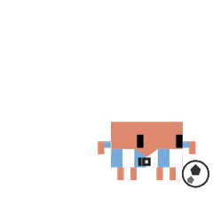 | 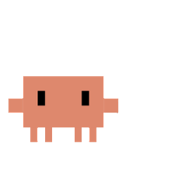 | 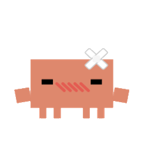 | 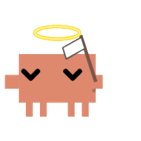 | 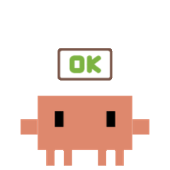 | 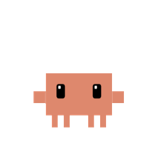 |
| kick (Messi) | flying kiss | sick | surrender | ok | cute |
| 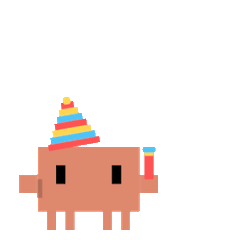 | 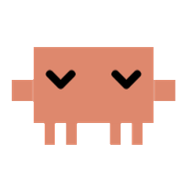 | 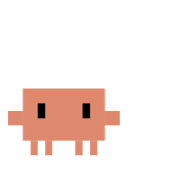 | 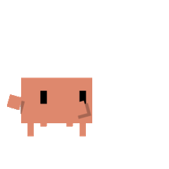 | 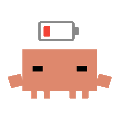 | 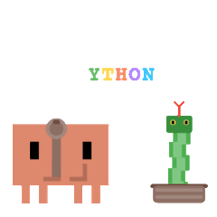 |
| congrats | crying | approved | running | burned out | python (snake charmer) |

The gallery is organized into named collections:

- `assets/upstream/` — base animations referencing clawd-tank (read-only)
- `assets/original/` — the project's own library (read-only)
- `assets/<your-name>/` — your own collection (`promote_svg.py` asks for a name)

The more good captioned animations it holds, the better the skill gets. 😎 **Made
an emote you like? Contributions are welcome** — open a PR adding your animation
(`svg` + `caption`) under a collection and its GIF under `wechat_stickers/`, and
help grow a shared public knowledge base.

## Export a GIF

Just ask the agent to "export a GIF", or run the exporter yourself:

```bash
python tools/svg_to_gif.py \
  --input workspace/clawd-<name>.svg \
  --output workspace/gif/clawd-<name>.gif
```

The exporter **auto-crops to the animation and scales it to a tidy 240×240
square**, so Clawd always comes out a sensible size — no manual cropping. The
result is a transparent, loopable **GIF sticker** (kept small, typically well
under 500 KB) that you can drop straight into WeChat or any chat app. (It took a
lot of trial and error during my WeChat sticker work to get here — the current
version should play nicely with WeChat.)

Some clients render transparent GIFs poorly; add `--background white` for those.
Rendering runs a hard-timed Chrome per frame, so it can never stall — use
`--workers 1` for the serial safe baseline if you ever need it.

## Credits & License

The code is MIT licensed. Clawd's base character design references the
open-source [clawd-tank](https://github.com/marciogranzotto/clawd-tank) project
(MIT); see [ASSETS.md](ASSETS.md) for the asset-usage policy. The render-and-look
check approach is inspired by
[clawd-emotes-skill](https://github.com/xixicc186/clawd-emotes-skill).
